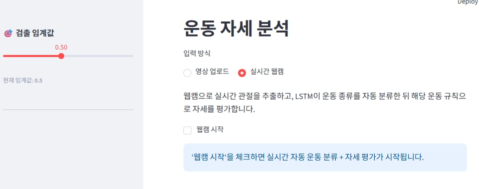
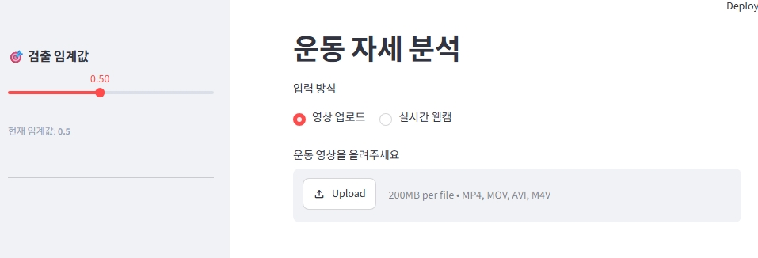
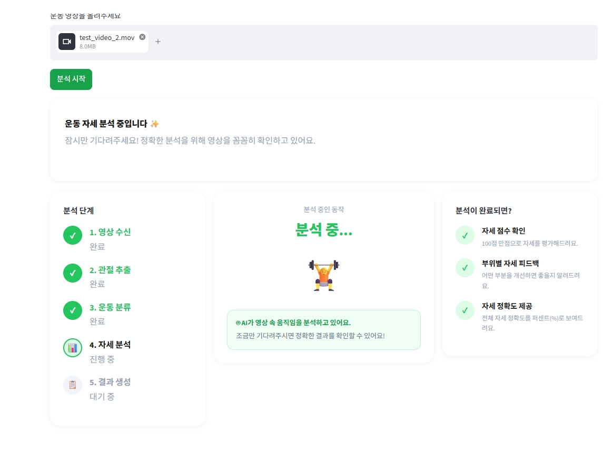
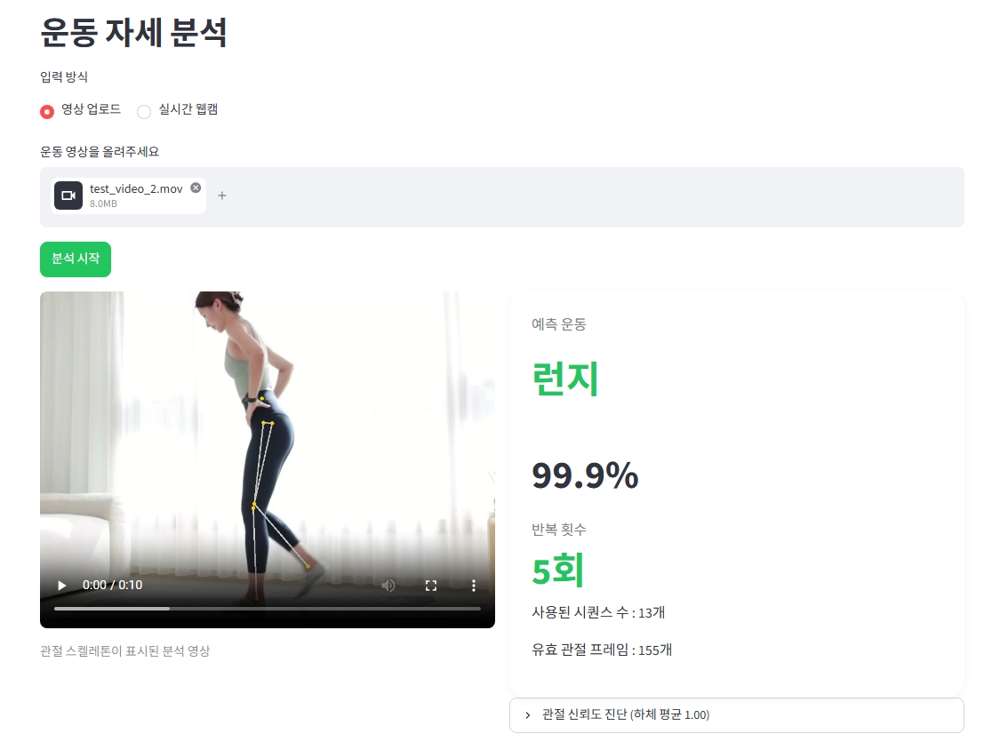
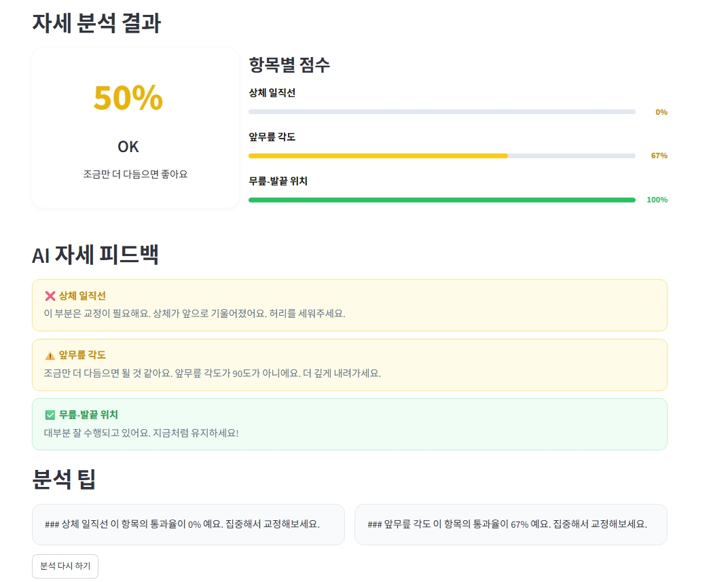
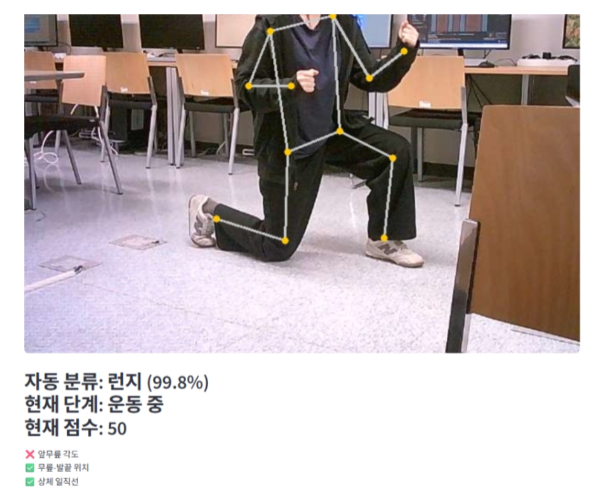

# 🏋️ AI-based Exercise Pose Analysis System

YOLOv8 Pose와 LSTM 기반의 **실시간 운동 자세 분석 및 운동 분류 시스템**

---

## 📌 Overview

본 프로젝트는 **사용자가 업로드한 운동 영상 또는 웹캠 영상**을 기반으로 운동 종류를 자동 분류하고, 관절 각도 및 신체 정렬 상태를 분석하여 **자세 평가와 피드백을 제공하는 AI 기반 운동 자세 분석 시스템**입니다.

### Supported Exercises

* **Lunge**
* **Leg Raise**
* **Plank**
* **Knee Push-up**

### Main Features

* 운동 영상 업로드 및 웹캠 입력 지원
* YOLOv8 Pose 기반 **17개 관절 좌표 추출**
* LSTM 기반 **운동 종류 자동 분류**
* 규칙 기반 **자세 평가 및 피드백 제공**
* Streamlit 기반 결과 시각화

---

## 🖼 Demo
### Start Page



### Waiting Status


### Main Page - Video




### Main Page - Web Camera


---

## 🛠 Development Environment

### Environment

* **OS**: Windows 10 / 11
* **Python**: 3.12
* **GPU**: NVIDIA GeForce RTX 4060
* **Framework**: PyTorch, Ultralytics YOLOv8
* **UI**: Streamlit

### Dependencies

* YOLOv8 Pose
* LSTM
* PyTorch
* ONNX Runtime
* OpenCV
* NumPy
* Pandas
* Streamlit

---

## 🔧 System Architecture

```text
Input Video / Webcam
        ↓
YOLOv8 Pose
(17 Keypoints Extraction)
        ↓
LSTM
(Exercise Classification)
        ↓
Rule-based Pose Analysis
        ↓
Feedback & Visualization
```

---

## 📂 Data Pipeline

### 1) Dataset Construction

본 프로젝트에서는 **직접 촬영한 운동 영상**과 **다양한 운동 영상 추츨(Youtube)**을 활용해 데이터셋을 구축했습니다.

#### Custom Dataset

* 직접 촬영한 운동 영상 사용
* 다양한 각도, 조명, 옷차림, 배경 환경 반영
* 운동별 약 4~5개 영상 제작

#### YouTube Dataset

* 운동별 약 11~12개 영상 수집
* 약 **13,000장의 프레임 데이터** 구축

### 2) YOLO Pose Data Processing

* 영상에서 프레임 추출
* YOLO Pose 기반 관절 좌표 추출
* 수동 라벨 검수를 통해 학습용 데이터셋 정제
* 운동 자세에 맞는 관절 추출 성능 향상을 위해 파인튜닝 수행

### 3) LSTM Data Processing

* YOLO Pose로 추출한 관절 좌표를 시퀀스 데이터로 변환
* 좌표, 속도, 정적 특징을 결합하여 LSTM 입력 데이터 생성
* **35프레임 단위 시퀀스**로 운동 분류 학습 진행

---

## 🧠 Model Summary

### 1) YOLOv8 Pose

운동 영상에서 사용자의 **17개 관절 좌표를 추출**하는 모델입니다.
직접 구축한 운동 자세 데이터셋으로 파인튜닝하여 운동 환경에서의 관절 추출 성능을 개선했습니다.

### 2) LSTM

YOLO Pose로 추출한 관절 좌표 시퀀스를 입력받아 운동 종류를 분류합니다.

최종 분류 운동:

* Lunge
* Leg Raise
* Plank
* Knee Push-up

### 3) Rule-based Pose Evaluation

분류된 운동 종류에 따라 **관절 각도, 정렬, 대칭성** 등을 기준으로 자세를 평가합니다.

예시:

* **Lunge**: 무릎 각도, 무릎-발끝 정렬, 상체 정렬
* **Plank**: 어깨-팔꿈치 각도, 척추 정렬
* **Knee Push-up**: 팔꿈치 각도, 전신 정렬
* **Leg Raise**: 다리 신전, 골반 정렬

---

## 📦 Model Weights

GitHub 업로드 제한으로 인해 대용량 가중치 파일(`.pt`, `.onnx`, `.pth`)은 레포지토리에 포함하지 않았습니다.
아래 링크에서 다운로드 후 `models/` 폴더에 넣어주세요.

### Download Links

* **YOLO Pose weights**: [Google Drive Link](https://drive.google.com/file/d/1fLu4qYse7poO6cb6jGgMaYmvJowxdMRC/view?usp=drive_link)
* **LSTM weights**: [Google Drive Link](https://drive.google.com/file/d/1yUWUXh5acNg2qs7VQ-yjYn1_UVothj06/view?usp=drive_link)

### Required Directory Structure

```text
models/
├─ yolos_ph2_best.pt
├─ yolos_ph2_best.onnx
├─ exercise_lstm_velo.pth
├─ exercise_lstm_velo.onnx
└─ lstm_velo_config.json
```

---

## ▶️ Run

### 방법 1. `run.bat`로 실행 (권장)

Windows에서는 프로젝트 루트의 `run.bat` 파일을 실행하면 됩니다. (python 3.12 권장)
이 스크립트는 아래 작업을 자동으로 수행합니다.

* `.venv` 가상환경이 없으면 자동 생성
* 가상환경 활성화
* `requirements.txt` 설치
* Streamlit 앱 실행

```bash
run.bat
```

### 방법 2. 직접 실행

```bash
python -m venv .venv
.venv\Scripts\activate   # Windows
pip install -r requirements.txt
streamlit run app_pose.py
```
---

## ♻️ Reproducibility

본 프로젝트는 **새 PC에서 레포지토리를 clone한 뒤, `requirements.txt` 설치 후 실행 가능하도록** 구성했습니다.

### Reproducibility Notes

* 로컬 절대경로(`C:\Users\...`) 대신 **상대경로 기반 설정** 사용
* `requirements.txt`를 통한 패키지 설치 지원
* 대용량 데이터셋 및 실험 산출물은 `.gitignore`로 제외
* 모델 가중치는 별도 다운로드 후 `models/` 폴더에 배치

---

## 📁 Project Structure

```text
.
├─ app_pose.py
├─ analyzer.py
├─ pose_rules.py
├─ config.py
├─ requirements.txt
├─ run.bat
├─ README.md
│
├─ models/
│  ├─ yolos_ph2_best.pt
│  ├─ yolos_ph2_best.onnx
│  ├─ exercise_lstm_velo.pth
│  ├─ exercise_lstm_velo.onnx
│  └─ lstm_velo_config.json
│
├─ dataset-cf/
│  └─ data.yaml
│
└─ assets/
   ├─ app_main.png
   └─ app_result.png
```

---

## 👨‍💻 Team Members

### 김민진 (20220907)

* 데이터 수집 및 전처리
* 운동별 규칙 정의 및 자세 평가 로직 구현
* Streamlit UI 및 결과 시각화 구현
* PPT 제작 및 보고서 작성

### 이유나 (20220988)

* 데이터 수집 및 전처리
* 데이터 수동 라벨링
* LSTM 모델 설계 및 학습
* YOLOv8 Pose 모델 학습
* PPT 제작 및 보고서 작성